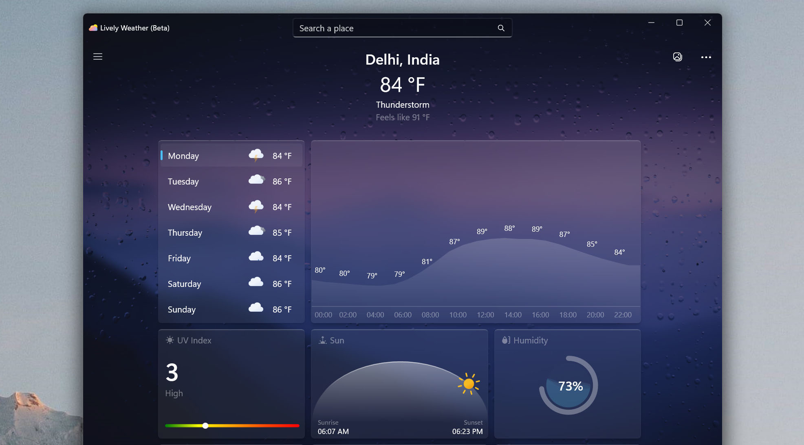

  
  <h2 align="center">Lively Weather</h2>

## Contents

- [About](#about)
- [Features](#features)
- [Download](#download)
- [Building](#building)

## About

https://github.com/user-attachments/assets/b4996b2e-a653-43dd-a3f8-4d3311959832

Windows native weather app powered by DirectX12 animations.

## Features

### 100% Native
https://github.com/rocksdanister/weather/assets/17554161/eb8c0c72-9fa6-4f7d-a4c1-888231060366

- Native UWP app powered by DX12, Win2D.
- Fast startup and small install size.
- Fluent inspired clean design.
### Desktop First
https://github.com/rocksdanister/weather/assets/17554161/f12c8ab1-20db-4ced-9086-a33e0d724915

- Desktop first design and features.
- Snow and other weather particles that move with inertia when window is moved. 
- Subtle weather pause animation when window out of focus.
### Weather Forecast
https://github.com/rocksdanister/weather/assets/17554161/a18f926b-ab40-4fa9-b573-3ab9ad08aed8

 - Weekly weather and air quality forecast.
 - Switch between multiple weather sources.
 - Pin forecast for upto 5 locations.
### White Noise
https://github.com/rocksdanister/weather/assets/17554161/401aeddf-f436-4618-86a9-b4882d80b02e

- Relax with weather white noise sound effects that dynamically changes with the visual.
- Select custom sound in screensaver mode and use it as white noise app.
 ### Fun
https://github.com/rocksdanister/weather/assets/17554161/350d1b69-0d05-4f2f-ae1b-6da126fb75d8

- Create your own weather in screensaver mode!
- Create depth background effects using AI.
- Fullscreen mode.

## Download

https://apps.microsoft.com/store/detail/9PP0MFQFVSC5

## Building

Instructions for building the application can be found [here.](https://github.com/rocksdanister/weather/wiki/Building)
